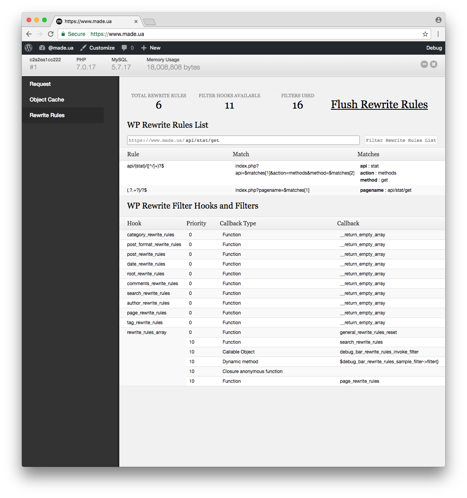

# Debug Bar Rewrite Rules

* Contributors: @butuzov
* Donate Link: http://wordpress.org
* Tags: permalinks, rewrite rules, tests, testing, debug, debug bar
* Requires at least: 3.4
* Tested up to: 5.2.4
* Stable tag: 0.6.3
* License: GPLv2 or later
* License URI: http://www.gnu.org/licenses/gpl-2.0.html

Debug Bar Rewrite Rules adds a new panel to Debug Bar that displays information about WordPress Rewrites Rules (if used).

## Description

Debug Bar Rewrite Rules adds information about Rewrite Rules (changed via filters) to a new panel in the Debug Bar. This plugin is an extension for [Debug Bar](http://wordpress.org/extend/plugins/debug-bar/), but it is also can work in standalone mode (as admin tools page). Note: this plugin not able to track `add_rewrite_rule` function calls, for a reason this function is untraceable.

Once installed, you will have access to the following information:

* Number of existing rewrite rules
* List of rewrite rules
* List of available filter hooks that can affect rewrite rules.
* List of filters that affects rewrite rules.
* Ability to search in rules with highlighting matches.
* Ability to test url and see what rules can be applied to it.
* Ability to flush rules directly from debug bar panel/tools page.

## Screenshots

